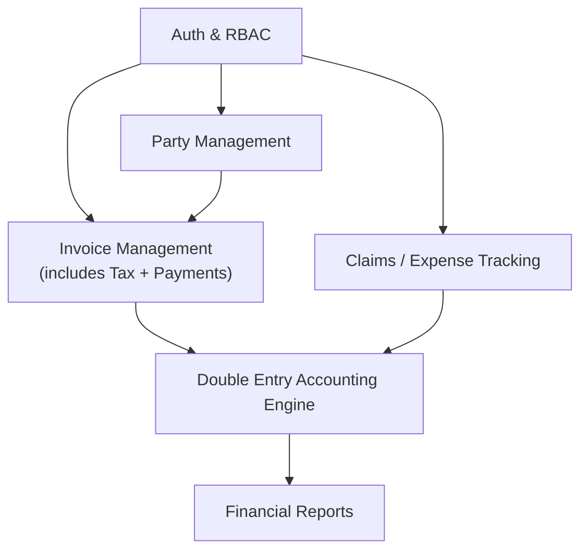

## Tech Stack

| Layer            | Technology                              |
| ---------------- | --------------------------------------- |
| Language         | Rust                                    |
| Web Framework    | Actix Web                               |
| Template Engine  | Tera                                    |
| Database         | SQLite (via SeaORM, WAL mode)           |
| CSS Framework    | Tailwind CSS + DaisyUI                  |
| Authentication   | actix-identity + actix-session (cookie) |
| Password Hashing | argon2                                  |
| Decimal Type     | rust_decimal                            |
| Task Runner      | just                                    |

### Template Composition

- `` + ``
  - page layouts
- ``
  - shared partials (navbar, footer)
- ``
  - reusable UI components (cards, tables, buttons)

### Database Configuration

- `PRAGMA journal_mode=WAL`
  - enables concurrent reads during writes
- `PRAGMA foreign_keys=ON`
  - enforce referential integrity per connection
- Monetary values stored as `NUMERIC(15,4)`
  - **Precision 15** supports values up to 999,999,999,999,999 (999 trillion), far exceeding any realistic single-entry amount while fitting within `rust_decimal`'s 28-digit mantissa.
  - **Scale 4** decimal places provides 2 display places (cents for SGD) plus 2 buffer places for intermediate calculations. This follows GAAP practice and matches the Microsoft SQL Server `money` type convention. Rounding to 2 decimal places for display happens only at the presentation layer.
  - **Default rounding**: `rust_decimal` uses banker's rounding (`RoundingStrategy::MidpointNearestEven`) by default, which is the standard for financial systems (ISO 9742 / IEEE 754 round-to-nearest-even). Never use `to_f64()` or `f64` intermediary.

---

## Cross-Cutting Features

### Search & Filtering

Shared search/filter system applied across modules. Each module supports text search and column-based filters via a consistent UI (filter sidebar + search bar).

| Module          | Search By                               | Filter By                                        |
| --------------- | --------------------------------------- | ------------------------------------------------ |
| Invoices        | invoice number, party name              | party, status, issue date, due date              |
| Claims          | employee name, claim title, category    | date range, employee, category, status           |
| Parties         | name, company                           | type (customer/vendor), status (active/inactive) |
| Journal Entries | entry number, account name, description | date range, account type, source type            |

### Table Views

All list pages share a consistent table view with:

- Sortable columns
- Row totals for current filtered view
- Pagination

### PDF Export (Stretch Goal)

Where applicable, modules support PDF generation:

- Invoices
  - individual invoice document
- Parties
  - party invoice
  - invoice history
- Financial Reports
  - income statement export

### Chart of Accounts CRUD (Stretch Goal)

Allow Admin/Accountant to create, edit, and deactivate accounts beyond the seeded defaults.

---

## Auth & RBAC

- User registration, login, logout
- Session management via `actix-identity` + `actix-session` (cookie-based)
- Password hashing with `argon2`
- Account enable/disable (soft lockout via `disabled` flag)
- Role-based access control with three roles:
  - Admin
    - Full system access
    - User management (including disable/enable accounts)
  - Accountant
    - Approve claims
    - Record payments
    - Post to ledger
    - Access all financial reports
  - Staff
    - Can create invoices
    - Submit claims (cannot approve or post to ledger)

### Role Gates

| Action                                  | Admin | Accountant | Staff |
| --------------------------------------- | ----- | ---------- | ----- |
| Create/edit invoices                    | ✓     | ✓          | ✓     |
| Submit claims                           | ✓     | ✓          | ✓     |
| Void invoices                           | ✓     | ✓          | ✗     |
| Record payments                         | ✓     | ✓          | ✗     |
| Approve/reject claims                   | ✓     | ✓          | ✗     |
| Post to ledger (manual journal entries) | ✓     | ✓          | ✗     |
| Access financial reports                | ✓     | ✓          | ✗     |
| Manage users                            | ✓     | ✗          | ✗     |

---

## Party Management

### Party CRUD

- Add, edit, deactivate (preserve accounting history), search/filter
- Party type distinction: Customer vs. Vendor

### Invoice & Payment Integration

- One-to-many (party → invoices)
- Support partial payments

### Party Dashboard

- Party info
- Invoice count
- Total spending
- Recent payments

---

## Invoice Management

_Consolidated module: includes tax calculation and payment recording._

### CRUD Operations

- Create, view, edit, void/delete invoices
- Auto-generated invoice numbers
- Invoice preview and print-ready layout

### Statuses & State Transitions

| From           | To             |
| -------------- | -------------- |
| Draft          | Sent           |
| Draft          | Voided         |
| Sent           | Partially Paid |
| Sent           | Paid           |
| Partially Paid | Paid           |

### Invoice Items

- Quantity
  - number of items/services billed
- Unit Price
  - price per item/service
- Description
  - item/service description
- GST
  - enum: `NONE` or `STANDARD` (9%, hardcoded Singapore GST rate)
  - inclusive in total; no separate Tax Payable posting
- Auto-calculated fields:
  - item total
  - subtotal
  - GST amount
  - final payable

### Payment Recording

- Record payments against invoices
- Payment direction: IN (customer pays us) and OUT (we pay vendor)
- Nullable `party_id` allows payments not tied to a specific party
- Nullable `invoice_id` allows payments not tied to a specific invoice
- Optional `remarks` text field
- Partial payment tracking
  - auto-updates invoice status to Partially Paid or Paid
- Payment history per party and per invoice

### Double Entry Posting (Invoice)

When an invoice is sent (posted to ledger):

| Account             | Debit         | Credit        |
| ------------------- | ------------- | ------------- |
| Accounts Receivable | Invoice total |               |
| Sales Revenue       |               | Invoice total |

> GST is inclusive. The invoice total (subtotal + GST) is posted as a single amount to Sales Revenue. No separate Tax Payable line.

### Double Entry Posting (Payment)

When a payment is recorded against an invoice:

| Account             | Debit          | Credit         |
| ------------------- | -------------- | -------------- |
| Cash                | Payment amount |                |
| Accounts Receivable |                | Payment amount |

---

## Claims / Expense Tracking

### Dashboard

- Total expenses, amount pending approval, monthly/yearly spending trend
- Status summary: pending / approved / rejected
- Filters: date range, employee, category, status

### Claims Management

### Submission Fields

- Employee Name (via `submitted_by_user_id`)
- Claim Title
- Category (via ClaimCategory)
- Description
- Amount
- Date of purchase

### Approval Flow

1. Submit
   - Staff creates claim
   - Status: Pending
2. Review
   - Admin/Accountant approves or rejects
   - Rejection includes `rejection_reason` (nullable)
   - Status: Approved/Rejected
3. Post
   - Approved claims create journal entries via PostingService

### Double Entry Posting (Claim Approval)

When a claim is approved (posted to ledger):

| Account            | Debit        | Credit       |
| ------------------ | ------------ | ------------ |
| Operating Expenses | Claim amount |              |
| Accounts Payable   |              | Claim amount |

---

## Double Entry Accounting Engine (Core)

### Chart of Accounts

Seed default accounts for common categories:

| Type      | Account             | Normal Balance |
| --------- | ------------------- | -------------- |
| Asset     | Cash                | Debit          |
| Asset     | Accounts Receivable | Debit          |
| Expense   | Cost of Goods Sold  | Debit          |
| Expense   | Operating Expenses  | Debit          |
| Liability | Accounts Payable    | Credit         |
| Equity    | Owner's Equity      | Credit         |
| Equity    | Retained Earnings   | Credit         |
| Revenue   | Sales Revenue       | Credit         |

### Journal Entries

- Header-line model: `JournalEntry` (header) + `JournalEntryLine` (debit/credit lines)
- State machine: Draft → Posted; immutable after posting
- Each line records: `account_id`, `entry_side` (DEBIT/CREDIT), `amount`, `description`
- Source document tracking via nullable foreign keys: `payment_id` and/or `claim_id`

### Posting Service

Centralized service that all modules call to post journal entries:

- Wraps all inserts in a database transaction (`SeaORM::TransactionTrait`)
- Validates total debits = total credits before persisting
- Links to source document via nullable `payment_id` and/or `claim_id` foreign keys
- No module posts directly to the ledger
  - All posting goes through PostingService

### Ledger Balancing

- Validate that total debits equal total credits per journal entry
- Compute account balances from journal entry lines on demand
  - No cached running balance for MVP
- Trial balance report verifies sum(all debits) = sum(all credits)

### Audit Trail

- Every posted entry includes: `created_by_user_id`, `created_at`
- Source document linkage via nullable `payment_id` or `claim_id` foreign keys
- No deletion of posted entries
  - Corrections use reversal entries
- Full traceability from any journal entry back to its source document

---

## Financial Reports

### Dashboard

- Total revenue, total expenses, outstanding receivables, voided invoice count
- At-a-glance financial health indicators

### Income vs. Expense

- Paid invoices vs. approved claims by month
- Bar/line chart showing trend over time

### GST Summary

- Invoices grouped by GST rate (NONE, STANDARD)
- Taxable amount + GST collected per rate
- Total GST liability

### Profit & Loss (Income Statement)

- Revenues, expenses, and net profit (or loss) over a stated period
- Queries against ledger data (journal entries grouped by account type)

### Trial Balance

- All accounts with debit/credit totals
- Verification that sum(debits) = sum(credits)
- Date-range filter

---

## Module Dependency Graph

